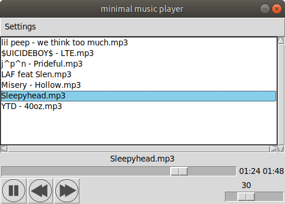

# minimal music player
Music player based on tkinter library and vlc module

## Installing
#### You will need:
- python 3.6.9
- python3-tk


Clone the project in a virtual environment, then:

```bash
pip install -r requirements.txt
```
> You can change the music directory inside `settings.json`
---
## Usage
Start the script with:
```bash
python3 main.py
```
---
## Screenshot

